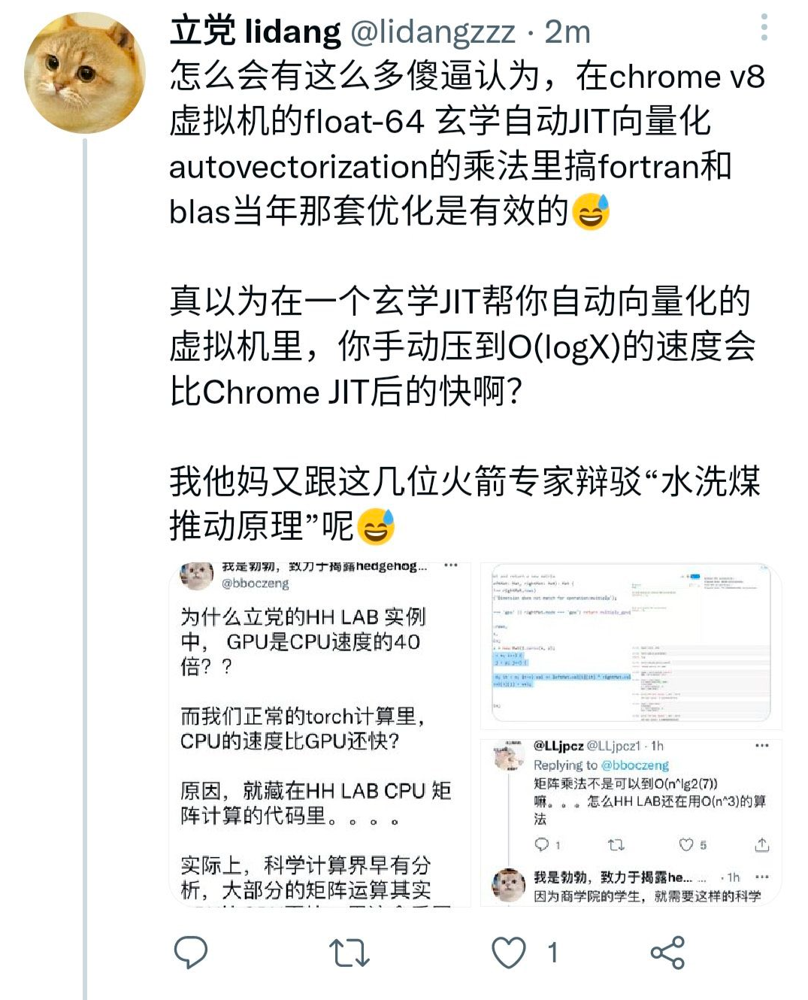
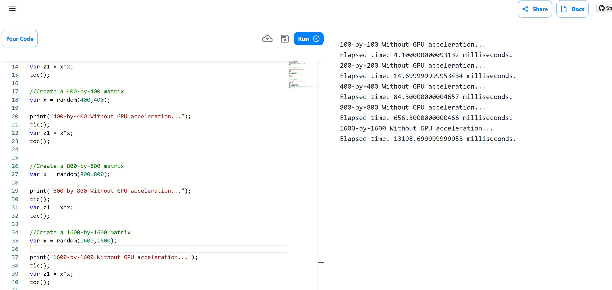
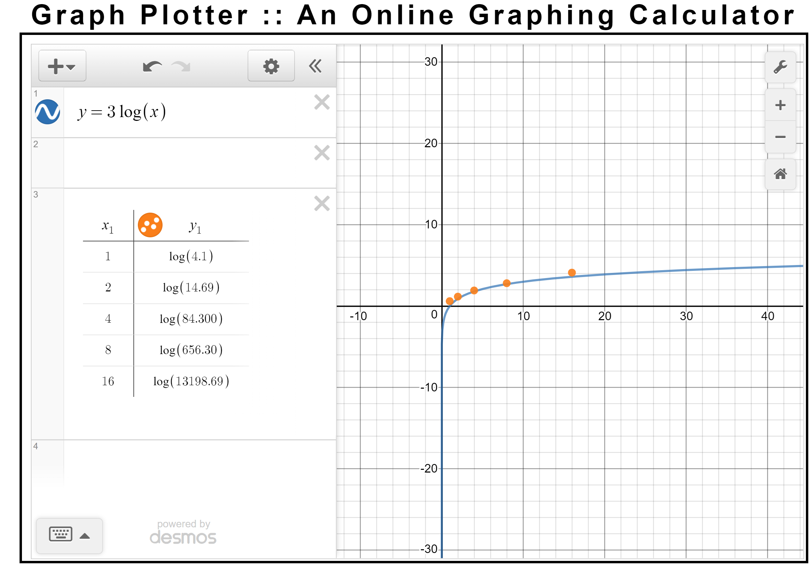

# hedgehoglab CPU 矩阵乘法时间复杂度分析
 
Hedgehog Lab 号称自己的WEBGL GPU加速下的矩阵乘法运算是CPU版本的40倍，这一结果非常吊诡。因为在同等条件下，torch自带的CPU/CUDA 矩阵乘法比较结果是，CPU比CUDA还要快100%。那么，WEBGL的加速性能明显不如CUDA的前提下，Hedgehog Lab是如何做到脚踩CUDA，做到相同条件下，比同一个CPU的矩阵乘法还要快的呢？

## hedgehoglab 矩阵乘法算法分析

调阅HHLAB的源代码不难发现，HHLAB的CPU矩阵乘法是未经优化的N^3最差时间复杂度算法。

## 是否存在V8引擎的自动向量化？

HHLAB的创始人认为，V8引擎会自动对for loop进行向量化，加速这一最简单版本的乘法算法。事实真的是这样的吗？

## 时间复杂度分析

通过对100X100, 200X200, 400X400, 800X800, 1600X1600大小随机矩阵进行乘法运算，通过HHLAB自己的工具记录时间如下。测试用的浏览器为GOOGLE CHROME最新版，应该支持V8。

## 最终结论

并且作图，我们不难发现： HHLAB的CPU 矩阵乘法的时间复杂度，就是N^3。所谓自动向量化的说法不攻自破

